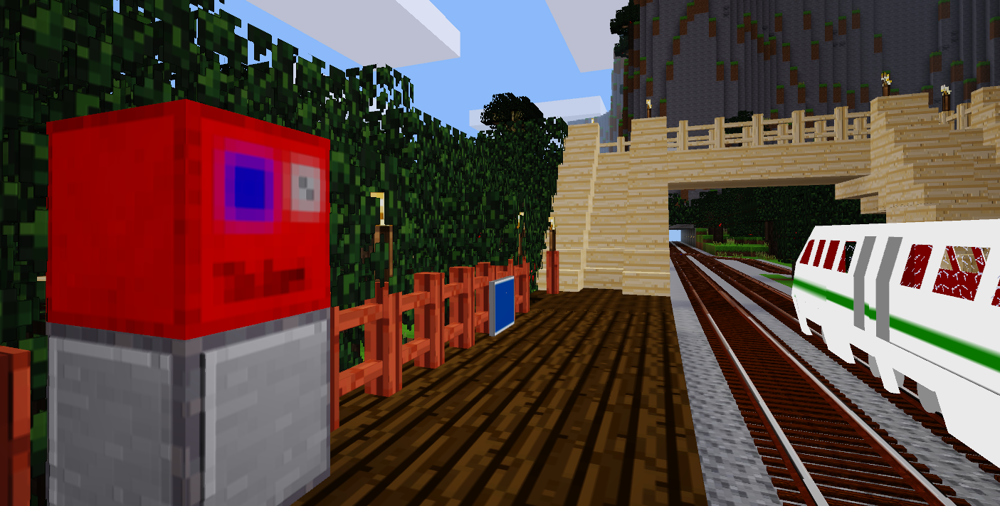
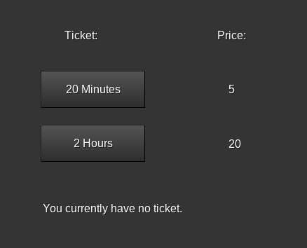

# Minetest Mod: TicketVendingMachine
This mod depends on the atm mod: https://forum.minetest.net/viewtopic.php?f=9&t=15029

## How does it work?
In Creative Mode you could place some Ticket Vending Machines.
There are two options of a ticket. The first one is valid for 20 Minutes, and the second one is valid for two hours. It can be bought with your money account from the atm mod.
You can configure the prices, the expire duration and the name of the ticket in the int.lua easiely.

With `/check_ticket <playername>` you can check, whether the player has a valid ticket or not.

## For Developers:
Whith the function `ticket_vending_machine_check_ticket(player)` you can also check, if the player has an valid ticket. It returns true, false, or nil, if the player isn't online or doesn't exist.

The Information about a valid ticket is stored in the players meta.

----

# minetest_ticketVendingMachine
